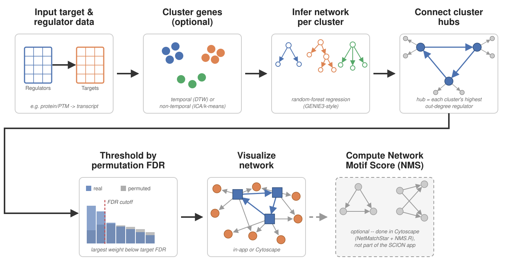

# SC-ION
Spatiotemporal Clustering and Inference of Omics Networks (SC-ION)

[](https://zenodo.org/badge/latestdoi/232898677)



# Citing SC-ION
If using SC-ION in your own work, please cite both this repository (using the DOI link above) and:

Clark, N.M., Nolan, T.M., Wang, P. et al. Integrated omics networks reveal the temporal signaling events of brassinosteroid response in Arabidopsis. Nat Commun 12, 5858 (2021). https://doi.org/10.1038/s41467-021-26165-3

# Also available via PANOPLY

SCION is also available as a task within [PANOPLY](https://github.com/broadinstitute/PANOPLY), a suite of proteogenomic data analysis pipelines for Terra.

# Installation

```r
install.packages("devtools")
devtools::install_github("nmclark2/SCION")
```

# Quick start

To use the Shiny app:

```r
SCION::launchApp()
```

Click "Load example data" in the sidebar to try it with a real dataset before uploading your own.
The app walks through three steps: run a network, threshold it (by FDR or a flat weight cutoff),
and visualize it. See the Help tab in the app for details on each option.

To run from a script instead:

```r
library(SCION)
result <- run_scion(
  target_data_file = "target.csv",
  reg_data_file = "regulators.csv"
)
```

See `?run_scion` for all options, including clustering, permutation-based FDR, and PTM-aware
regulator names, or [SCION.pdf](SCION.pdf) for a complete reference manual of every function
(regenerated automatically whenever the code changes).

# Tutorials

- A book chapter tutorial has been published: Clark, N.M., Hurgobin, B., Kelley, D.R., Lewsey, M.G., Walley, J.W. (2023). A Practical Guide to Inferring Multi-Omics Networks in Plant Systems. In: Kaufmann, K., Vandepoele, K. (eds) Plant Gene Regulatory Networks. Methods in Molecular Biology, vol 2698. Humana, New York, NY. https://doi.org/10.1007/978-1-0716-3354-0_15. A pre-print of this book chapter is available at [](https://doi.org/10.5281/zenodo.8339502)

- Its accompanying vignette, [`legacy/SCION_v3.2_vignette.html`](legacy/SCION_v3.2_vignette.html), is kept for reference but describes SC-ION version 3.2 and is now historical -- it predates the current package structure, the Shiny app's Help tab, and the permutation/FDR workflow. For version 5+, the Help tab in the app is the up-to-date reference; to replicate the tutorial's own results, leave all parameters added after 3.2 at their defaults.

# Version History

# Version 5.0 - August 24, 2026

- SC-ION is now an installable R package (`devtools::install_github()`), replacing the old download-the-files-and-run-`START_SCION.R` workflow.
- The Shiny app has been rebuilt as a 3-tab workflow -- Run, Network Diagnostics, Visualize -- plus a Help tab documenting every parameter.
- Added permutation-based FDR thresholding (`run_scion(permute = TRUE)`, `permute_network()`, `compute_fdr_threshold()`), with an interactive FDR curve and adjustable cutoff in the app.
- Added network visualization (`plot_network()`), both a static plot and an interactive one in the app; Cytoscape import is still available for large networks or publication figures.
- Legacy tutorial and test-data files moved to a `legacy/` folder; the SC-ION v3.2 vignette is kept for reference but is historical.

# Version 4.2 - October 24, 2024
- SC-ION is not compatible with missing values. Previously, it was left to the user to remove missing values. Now, SC-ION will automatically filter any rows in the target, regulator, and clustering matrices with missing values. When this is performed, a message is printed to warn the user that there are missing values in the dataset which have been removed. If one wants to include the features with missing values, those values will need to be imputed.
- Package compatibility has been checked for R-4.3. SC-ION should be compatible with R-4.3.

# Version 4.1 - October 2, 2023
- The incorrect JA_FPKM_means.csv file was erroneously uploaded during a previous release. This file has now been updated to the correct version. All associated TEST data files have also been updated with the correct values. The tutorial can be used as-is, but you may notice changes in the test networks due to this change in the data. The networks should now be more consistent with the published versions. Thank you to Jeff Shen, UNLV for spotting this inconsistency.
- Fixed an issue in the create_data_tables.R utilities file.

# Version 4.0 - April 3, 2023

- There is now an option to use k-means clustering for non-temporal data. Unlike the other two methods, k-means does not use the threshold parameter. Instead, the number of clusters is chosen based on the dimension of the input matrix. The number of clusters is varied, and the silhouette index is used to choose an optimal number. If you wish to change the cluster number for k-means, you may alter the kmeans_clustering.R function.

- There is now an option to not normalize edge weights. Previously, edge weights were always normalized to the [0,1] range prior to trimming. This results in more edges in the network, as edge weights with negative values are transformed prior to trimming. Not performing normalization will result in a smaller network, as edge weights with negative values will be automatically trimmed. 

- Parallelization is now implemented in the RS.Get.Weight.Matrix.R function - the RS.Get.Weight.Matrix_cluster.R function is no longer necessary. The number of cores for parallelization can be specified in the RShiny App. Leaving the number of cores at the default value (1) will disable parallelization.

- All prior tutorials and test datasets can still be used, but the UI will now appear slightly different due to the newly implemented parameters.

# Version 3.3 Hotfix - December 2, 2022

- set.seed() is now used in the main SCION function rather than in the ICA clustering function. This ensures the network inference and clustering returns the same results across multiple runs. If you would rather have different networks depending on the run, simply comment out the set.seed() line in SCION.R.

- Fixed an error with running without clustering

# Version 3.3 - November 7, 2022

- Converts gene IDs to R-complaint rownames. If you have experienced errors using tables with certain gene ID formats, this should now be fixed. Please be aware that the conversion to R-compliant rownames may change the format of your gene ID (for example: if your gene ID started with "0", now it will start with "X0"). Please be aware of these changes in any downstream processing of the networks.

# Version 3.2 - August 4, 2022

- A tutorial is now included in the SCION_tutorial.html file.

# Version 3.1 - June 8, 2022

- New, published test data from Zander et al, 2020, Nature Communications are now included. The previous test data have been removed. By incorporating published, citable test data, we hope to improve reproducibility of results as more features are added in the future.

- A new "utilities" folder has been added which contains scripts that may be used for pre-processing data tables and downstream analysis of the network. The create_data_tables.R script may be used to prepare tables for input into SC-ION. The example files in the TEST.zip folder may be used to understand how the script works. The NMS.R script is used to calculate a network motif-based importance score from NetMatchStar output from Cytoscape. 

# Version 3.0 - April 6, 2022

- Known compatibility: R 3.6.3, R 4.1.3

- Packages are now automatically installed and loaded using the pacman package. 

- Cluster expression is no longer automatically plotted, and the "Cluster Plots" folder is no longer automatically generated. This is to reduce the runtime of the clustering methods. Cluster expression plots can still be generated by uncommenting the plotting code in the ica_clustering.R (non-temporal) and/or dtw_clustering.R (temporal) files.

- The help text present in the RShiny App Window is now also included as a .html vignette file.

- Fixes multiple issues with network inference including adding checks for enough regulators/targets when using clustering and dealing with PTM information in regulator names. We recommend users denote PTM sites in regulator names using a "." (e.g. SOX2.S35) as this is a character not usually present in gene symbols, making it easy to separate the PTM site from the gene name if desired in downstream processing.

- Networks are no longer trimmed automatically. Rather, the user chooses an edge weight cutoff to use for trimming. For more details, see the vignette.

- Changes definition of the clustering threshold for non-temporal clustering. For more details, see the vignette.

- Using the arrows on the edge weight or clustering thresholds will increment by 0.1. NOTE: There is a known issue on MacOS where the arrows will increment by twice the desired step size (e.g. 0.2 instead of 0.1). The user can always specify an exact number by typing it into the box.

- Adds a button which will save a screenshot of the window to the working directory.

# Version 2.1 - August 23, 2021

- Same as version 2.0, but archived for publication in Nature Communications: https://doi.org/10.1038/s41467-021-26165-3

# Version 2.0 full release - August 6, 2020

- No changes from beta version

# Version 2.0 beta - July 21, 2020

- Adds another clustering algorithm (ICA) more suitable for non-temporal data

- Adds options for Temporal or Non-temporal clustering 

- Adds option to upload cluster file 

- Adds option to not cluster 

- Adds option to not connect hubs 

- Adds RS.Get.Weight.Matrix_cluster which can be used to run GENIE3 in parallel. This is not implemented in the RShiny app. If you would like to use this version, simply replace all instances of RS.Get.Weight.Matrix with RS.Get.Weight.Matrix_cluster throughout SCION.

# Version 1.1 - March 27, 2020

- Fixes edge trimming formula

- Fixes issue setting working directory

- Adds optional functions for no clustering (SCION_no_clustering) and no hub connection (SCION_no_hubs). These are not yet implemented in the RShiny app.

# Version 1.0 - Jan 9, 2020 (first stable build)
